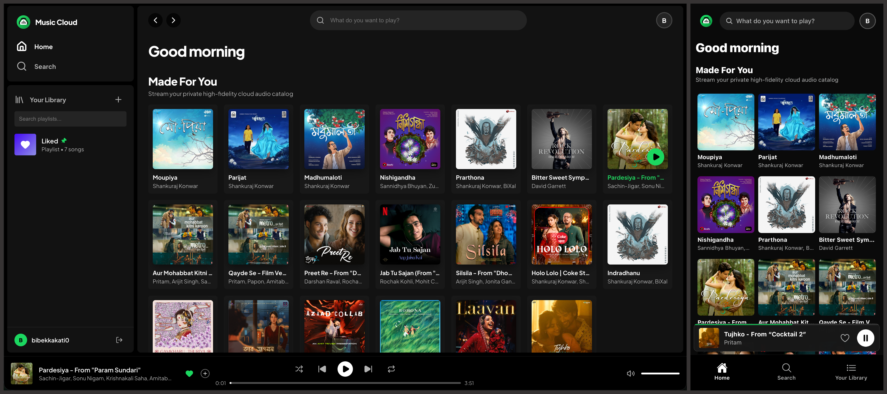

<p align="center">
  
</p>

<h1 align="center">Music Cloud</h1>

<p align="center">
  <strong>High-fidelity, self-hosted private music streaming platform and automated audio transcode pipeline.</strong>
</p>

<p align="center">
  <a href="https://turbo.build/repo"></a>
  <a href="https://fastapi.tiangolo.com/"></a>
  <a href="https://react.dev/"></a>
  <a href="https://www.cloudflare.com/developer-platform/r2/"></a>
  <a href="https://ffmpeg.org/"></a>
  <a href="#"></a>
</p>

---

## Overview

Music Cloud is a private audio streaming service engineered as a polyglot monorepo. It features an asynchronous FastAPI API server using FFmpeg for multi-bitrate HLS packaging, a React single-page client, and a globally distributed Cloudflare Edge Worker delivering protected audio streams and cached cover art directly from Cloudflare R2 object storage.

---

## User Interface & Experience

<p align="center">
  
</p>
<p align="center">
  <em><strong>Web & Mobile App View</strong>
</p>

<br />

---

## Architecture and Structure

The codebase is organized as a workspace monorepo powered by Turborepo and npm workspaces:

```text
music-cloud/
├── apps/
│   ├── api/             # FastAPI backend, SQLModel ORM, BullMQ queue, and FFmpeg transcode pipeline
│   ├── web/             # React 19 single-page web client with hls.js audio player
│   └── edge-worker/     # Cloudflare Worker for edge HLS delivery, token validation, and static CDN
│   └── mobile/          # React Native Expo client for andoird and iOS application
│
├── packages/
│   ├── types/           # Shared TypeScript models, API contracts, and JWT claims (@music-cloud/types)
│   └── tsconfig/        # Shared TypeScript compiler configuration presets (@music-cloud/tsconfig)
|   └── services/        # Shared API service calls for web and mobile client
│   └── utils/           # Shared utils for API, Edge Worker, and Mobile
│
├── assets/              # Branding assets, UI screenshots, and logos
├── package.json         # Workspace manifests, task definitions, and devDependencies
├── turbo.json           # Turborepo task pipeline configuration
└── .env.example         # Central environment variable template
```

---

## Core Features

- **Adaptive Bitrate HLS Streaming**: Packages multi-bitrate AAC streams (256 kbps, 320 kbps) with segment preloading and edge playlist caching.
- **Automated FFmpeg Transcode Pipeline**: Input tracks are inspected with `ffprobe`, embedded artwork is extracted to standardized JPEG files, and audio is segmented into 10-second chunks before concurrent upload to Cloudflare R2.
- **Edge CDN for Streaming**: HLS segments and cover art are served directly through the edge worker with immutable browser caching (`max-age`), avoiding slow presigned S3 URLs.
- **Secure Playback Token Authority**: Ephemeral x-hour HMAC-SHA256 JWT tokens authorize audio playback at the edge without exposing raw storage keys.
- **Typo-Tolerant Search**: In-memory catalog indexing powered by RapidFuzz provides fast search results resilient to typos and partial keywords.

---

## Component Documentation

Detailed technical documentation for each application is available in its respective directory:

| Component       | Description                                                                         | Reference                                                |
| :-------------- | :---------------------------------------------------------------------------------- | :------------------------------------------------------- |
| **API Server**  | FastAPI service, SQLModel database, BullMQ queue, and FFmpeg pipeline               | [apps/api/README.md](apps/api/README.md)                 |
| **Edge Worker** | Cloudflare Worker for token validation, HLS streaming, and static CDN caching       | [apps/edge-worker/README.md](apps/edge-worker/README.md) |
| **Mobile**      | React Native Expo client for andoird and iOS application                            | [apps/mobile/README.md](apps/mobile/README.md)           |
| **Web Client**  | React web application, `hls.js` integration, stream token manager, and admin studio | [apps/web/README.md](apps/web/README.md)                 |

---

## System Requirements

Ensure the following tools are available on the host machine:

- **Node.js**: 20.x or higher
- **npm**: 10.x or higher
- **Python**: 3.14.x or higher
- **uv**: 0.4.x or higher
- **FFmpeg & FFprobe**: 6.x or higher (installed and available on `$PATH`)

---

## Quick Start

### 1. Installation

Install all workspace dependencies and link internal packages:

```bash
git clone <repo-url> music-cloud
cd music-cloud
npm install
```

### 2. Environment Configuration

Configure all environment variables as mentioned in the `.env.example` file of each application (`/apps/*`).

### 3. Running Development Services

```bash
npm run dev:api      # Starts FastAPI on http://localhost:8000
npm run dev:web      # Starts Vite React client on http://localhost:5173
npm run dev:worker   # Starts Cloudflare Wrangler simulator on http://localhost:8787
npm run dev:mobile   # Starts React Native Expo client on http://localhost:8081
```

### 4. Running the API Server with Docker

The API server can be built and run using the root workspace scripts:

```bash
# Build the production Docker image (Python 3.14, FFmpeg, FFprobe, uv)
npm run docker:build:api

# Run the container with apps/api/.env mounted
npm run docker:run:api
```
